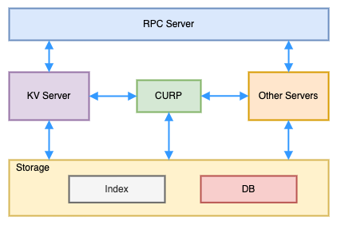

## 简介和背景

随着分布式业务从单数据中心向多数据中心发展，多地多活部署的需求也越来越普遍。这带来最大的挑战就是**跨数据中心跨地域的 metadata 管理**，metadata 对数据的稳定性和强一致性有极高要求。在单数据中心场景下，metadata 的管理已经有很多成熟的解决方案，etcd 就是其中的佼佼者，但是在多数据中心场景下，etcd 的性能受 Raft 共识协议的限制，它的性能和稳定性都大打折扣。DatenLord 作为高性能跨云跨数据中心的存储，对 metadata 管理有了跨云跨数据中心的要求。DatenLord 目前使用 etcd 作为 metadata 的管理引擎，但是考虑到 etcd 无法完全满足 DatenLord 的跨云跨数据中心的场景，我们决定实现自己的 metadata 管理引擎。Xline 应运而生，Xline 是一个**分布式的 KV 存储**，用来管理少量的关键性数据，并在跨云跨数据中心的场景下仍然保证高性能和数据强一致性。考虑到兼容性问题，Xline 会兼容 etcd 接口，让用户使用和迁移更加流畅。

## Xline 的架构



- Xline 的架构主要分为 RPC server，KV server，其他 server，CURP 共识协议模块和 Storage 模块
- RPC server：主要负责接受用户的请求并转发到相应的模块进行处理，并回复用户请求。
- KV server 和其他 server：主要业务逻辑模块，如处理 KV 相关请求的 KV server，处理 watch 请求的 watch server 等。
- CURP 共识协议模块: 采用 CURP 共识协议，负责对用户的请求进行仲裁，保证数据强一致性。
- Storage：存储模块，存储了 key value 的相关信息。

一次写请求的操作流程如下：

- RPC server 接收到用户写请求，确定是 KV 操作，将请求转发到 KV server。
- KV server 做基本请求做验证，然后将请求封装为一个 proposal 提交给 CURP 模块。
- CURP 模块执行 CURP 共识协议，当达成共识后，CURP 模块会调用 Storage 模块提供的 callback 将写操作持久化到 Storage 中。最后通知 KV server 写请求已经 commit。
- KV server 得知请求已经被 commit，就会封装请求回复，并通过 RPC server 返回给用户。

## Xline 的核心：CURP 共识协议

CURP 共识协议的细节介绍请参考 [DatenLord ｜ Curp 共识协议的重新思考](https://mp.weixin.qq.com/s?__biz=MzkwNTMzOTE2MA==&mid=2247484411&idx=1&sn=ea75ac5e8dd0e7b0275a8fefc87e06ad&chksm=c0f80b8cf78f829ade62d72086b6bac2232650cf46f8cd35e790703c686657526f9d62e53657&scene=21#wechat_redirect)。CURP 协议的优势是将非冲突的 proposal 达成共识所需要的 RTT 从 2 个降为 1，对于冲突的 proposal 仍然需要两个 RTT，而 etcd 等主流分布式系统采用的 Raft 协议在任何情况下都需要两个 RTT。从两个 RTT 降为一个 RTT 所带来的性能提升在单数据中心场景下体现的并不明显，但是在多数据中心或者跨云场景下，RTT 一般在几十到几百 ms 的数量级上，这时一个 RTT 的性能提升则相当明显。

## Storage 和 Revision

Xline 作为一个兼容 etcd 接口的分布式 KV 存储，etcd 重要的 revision 特性需要完全兼容。简单介绍一下 etcd 的 revision 特性，etcd 维护了一个全局单调递增的 64bit 的 revision，每当 etcd 存储的内容发生改变，revision 就会加一，也就是说每一次修改操作就会对应一个新的 revision，旧的 revision 不会立马删除，会按需延时回收。一个简单的例子，两个写操作 A -> 1，A -> 2，假设最初的 revision 是 1，etcd 会为 A = 1 生成 revision 2，为 A = 2 生成 revision 3。revision 的设计使 etcd 对外提供了更加丰富的功能，如支持历史 revision 的查找，如查询 revision 是 2 的时候 A 的值，通过比较 revision 可以得到修改的先后顺序等。以下是 etcd 对一个 **KeyValue** 的 proto 定义

```rust
message KeyValue {
  bytes key = 1;
  int64 create_revision = 2;
  int64 mod_revision = 3;
  int64 version = 4;
  bytes value = 5;
  int64 lease = 6;
}
```

一个 **KeyValue** 关联了三个版本号，

- create_revision: 该 key 被创建时的 revision
- mod_revision：该 key 最后一次被修改时候的 revision
- version：该 key 在最近一次被创建后经历了多少个版本，每一次修改 version 会加一

因为需要支持 revision 特性，Xline 的 Storage 模块参考了 etcd 的设计，分为 Index 和 DB 两个子模块。Index 模块存储的是一个 key 到其对应的所有 revision 数组的 mapping，因为需要支持范围查找，Index 采用了 BTreeMap，并会放在内存中。DB 模块存储的是从 revision 到真实 `KeyValue` 的 mapping，因为有持久化和存储大量的历史 revision 的数据的需求，DB 模块会将数据存到磁盘（目前 prototype 阶段 DB 仍然存在内存当中，在未来会对接持久化的 DB）。那么一次查找流程是先从 Index 中找到对应的 key，然后找到需要的 revision，再用 revision 作为 key 到 DB 中查找 `KeyValue` 从而拿到完整数据。这样的设计可以支持历史 revision 的存取，分离 Index 和 DB 可以将 Index 放在内存当中加速存取速度，并且可以利用 revision 的存储特性即每一次修改都会产生一个新的 revision 不会修改旧的 revision，可以方便 DB 实现高并发读写。

## CURP 共识协议带来的挑战

CURP 协议的全称是 **Consistent Unordered Replication Protocal**。从名字可以看出 CURP 协议是不保证顺序的，什么意思呢？比如两条不冲突的 proposal，A -> 1，B-> 2，在 CURP 协议中，因为这两条 proposal 是不冲突的，所以它们可以并发乱序执行，核心思想是执行的顺序并不会影响各个 replica 状态机的最终状态，不会影响一致性。这也是 CURP 协议用一个 RTT 就可以达成共识的关键。但是对于冲突的 proposal，如 A -> 1, A -> 2，CURP 协议就需要一个额外的 RTT 来确定这两条 proposal 的执行顺序，否则在各个 replica 上 A 最终的值会不一样，一致性被打破。

## 解决方案

解决这个问题的思路是将达成共识和确定顺序即 revision 分成两个阶段，即通过一个 RTT 来达成共识，这时候就可以返回用户请求已经 commit，然后再通过一个异步的 RTT 来确定请求的 revision。这样既可以保证一个 RTT 就可以达成共识并返回给用户，又可以保证为每一个修改请求生成全局统一的 revision。确定 revision 用异步 batching 的方式来实现，这一个额外的 RTT 会平摊到一段时间内的所有请求上并不会影响系统的性能。

Storage 模块会实现如下两个 callback 接口供 CURP 模块调用，`execute()` 会在共识达成后调用，通知 proposal 可以执行了，`after_sync()` 会在 proposal 的顺序确定下来后再调用，以通知 proposal 的顺序，`after_sync()` 接口会按照确定好的 proposal 顺序依次调用。

```rust
/// Command executor which actually executes the command.
/// It usually defined by the protocol user.
#[async_trait]
pub trait CommandExecutor<C>: Sync + Send + Clone + std::fmt::Debug
where
    C: Command,
{
    /// Execute the command
    async fn execute(&self, cmd: &C) -> Result<C::ER, ExecuteError>;

    /// Execute the after_sync callback
    async fn after_sync(&self, cmd: &C, index: LogIndex) -> Result<C::ASR, ExecuteError>;
}
```

为了配合 CURP 模块的两阶段操作，Storage 模块的设计如下：

```rust
/// KV store inner
#[derive(Debug)]
struct KvStoreInner {
    /// Key Index
    index: Index,
    /// DB to store key value
    db: DB,
    /// Revision
    revision: Mutex<i64>,
    /// Speculative execution pool. Mapping from propose id to request
    sp_exec_pool: Mutex<HashMap<ProposeId, Vec<Request>>>,
}
```

当 `execute()` 回调被调用时，修改 `Request` 会被预执行并存到 `sp_exec_pool` 中，它存储了 `ProposeId` 到具体 `Request` 的 mapping，这个时候该操作的 revision 并没有确定，但是可以通知用户操作已经 commit，此时只需一个 RTT。当操作顺序被确定后，`after_sync()` 会被调用，Storage 模块会从 `sp_exec_pool` 找到对应的 `Request` 并将它持久化，并把全局 revision 加 1 作为该操作的 revision。

接下来我们用一次写请求 A -> 1 和一次读请求 Read A 来讲解整个流程。假设当前的 revision 是

1. 当 KV server 请求收到写请求，它会生成一个 proposal 发给 CURP 模块，CURP 模块通过一个 RTT 达成共识后会调用 execute() callback 接口，Storage 模块会将该请求放到 sp_exec_pool 中，这时候 CURP 模块会通知 KV server 请求已经 commit，KV server 就会返回给用户说操作已完成。同时 CURP 会异步的用一个额外的 RTT 来确定该写请求的顺序后调用 after_sync() callback 接口，Storage 会把全局 revision 加 1，然后从 sp_exec_pool 中讲写请求读出来并绑定 revision
2. 然后更新 Index 并持久化到 DB 当中，这时候 DB 存储的内容是 revision 2：{key: A, value：1, create_revision: 2, mod_revision: 2, version: 1}。当读请求到达时，就可以从 Storage 模块中读到 A = 1，并且 create_revision = 2，mod_revision = 2。

## 总结

本文主要介绍了 Geo-distributed KV Storage Xline 的架构设计，以及为了兼容 etcd 的 revision 特性，我们对 CURP 共识协议和 Storage 模块做的设计，从而实现了在跨数据中心跨地域场景下的高性能分布式 KV 存储。详细代码请参考https://github.com/datenlord/Xline，欢迎大家来讨论。

## 推荐阅读

[Etcd 客户端缓存实践](https://mp.weixin.qq.com/s?__biz=MzkwNTMzOTE2MA==&mid=2247484030&idx=7&sn=965ab00d71c964f02a77ead2f099335d&chksm=c0f80a09f78f831fe4de322f49e3d6cf8cf993e5afcd6c93b3b7032a09b137d38f4d47b8e76d&scene=21#wechat_redirect)
